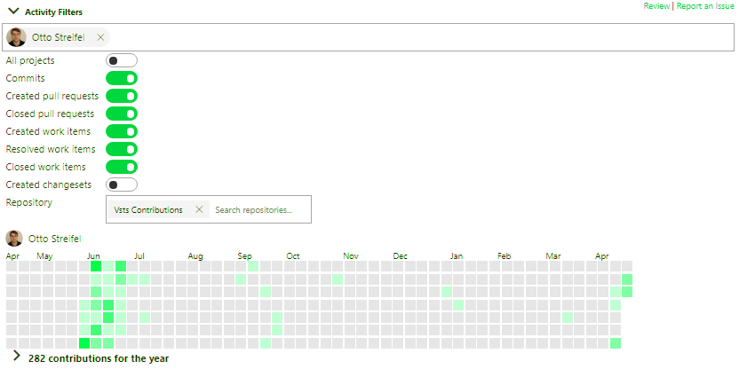
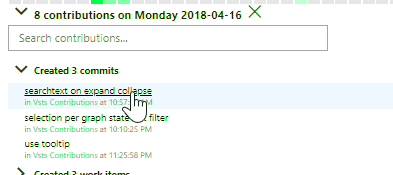
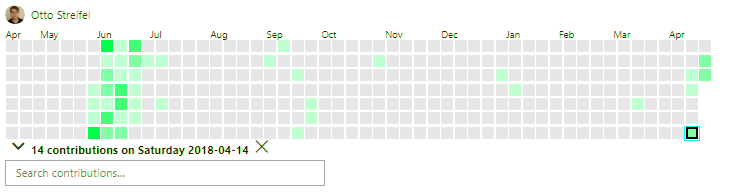
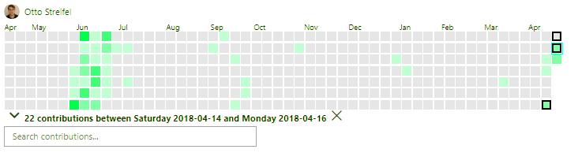
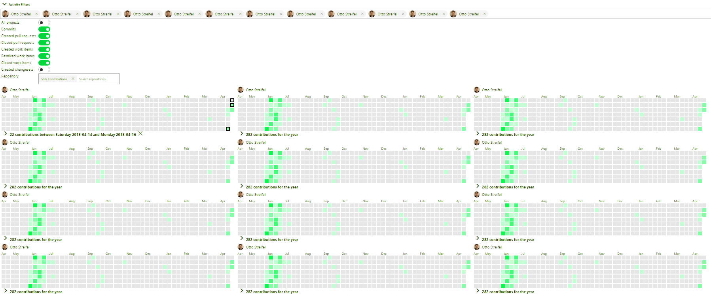

# Contributions Graph for Azure DevOps

A GitHub‑style contributions heatmap for Azure DevOps. It visualises your commits, pull requests, and work item activity as a calendar of coloured squares, so you can see your contribution history at a glance — right inside the **Boards** area of your Azure DevOps organisation.



## Features

- **Contribution heatmap** – a per‑day calendar with a green intensity scale (GitHub style), from light for a few contributions to dark for many.
- **Drill down** – click any day to see the exact contributions for that day.

  

- **Time ranges** – select a day, then shift‑click (mouse or keyboard) another day to expand the selected range.

  
  

- **Multiple users** – render and compare contributions for more than one identity.

  

- **Shareable URLs** – every filter change updates the URL, so views can be bookmarked and shared.

## About this fork

This is my own maintained fork of the original **VSTS Contributions** extension by Otto Streifel
(<https://github.com/ostreifel/vsts-contributions>), which was previously on the Visual Studio
Marketplace but is no longer listed.

I've re‑hydrated the project so it builds and packages again with a modern toolchain, published it
under my own publisher for private use, and restyled the contribution squares to a GitHub‑style
green palette.

> **Origin & credits:** The original extension was created by Otto Streifel. This fork was revived,
> rebuilt, and re‑documented with the help of **GitHub Copilot** and **Anthropic's Claude**, which
> assisted with assessing Azure DevOps compatibility, repairing the legacy build, restyling the
> graph, and rewriting this documentation. All original functionality remains the work of the
> upstream author.

## Compatibility

The extension is a client‑side hub built on the VSS Web Extension SDK. It targets:

- **Azure DevOps Services** (`Microsoft.VisualStudio.Services.Cloud`)
- **Azure DevOps Server / TFS** `15.0` and later

It contributes a **Contributions Graph** hub into the Boards (work) hub group and requires the
`vso.work` and `vso.code` scopes to read work items, commits, and pull requests.

## Repository structure

```
/scripts            - TypeScript source for the extension
/styles             - SCSS styles (contribution colours live in styles/colors.scss)
/img                - Image assets for the extension and marketplace listing
/dist               - Build output (generated)

contributionsHub.html - Main entry point
details.md            - Description shown on the marketplace listing
vss-extension.json    - Extension manifest (publisher, version, contributions)
webpack.config.js     - Webpack bundling config
gulpfile.js           - Build tasks (styles, webpack, package)
```

## Building from source

This project uses a legacy toolchain (gulp 4, webpack 4, `node-sass` 4). The reliable combination is
**Node 12 for the build** (so `node-sass` uses a prebuilt binary and doesn't need compilation) and a
**modern Node for packaging** (the current `tfx-cli` needs Node 18+).

1. **Clone the repository**

   ```
   git clone https://github.com/simonkprice/vsts-contributions.git
   cd vsts-contributions
   ```

2. **Install dependencies and produce an initial build** (run with Node 12)

   ```
   npm install
   ```

   The `postinstall` hook compiles the SCSS, bundles the TypeScript, and inlines everything into
   `dist/`.

3. **Rebuild after code or style changes** (Node 12)

   ```
   npm run package-dev
   ```

   Or rebuild just the assets without packaging:

   ```
   node ./node_modules/gulp/bin/gulp.js copy      # styles + inline HTML
   node ./node_modules/gulp/bin/gulp.js webpack   # bundle TypeScript
   ```

4. **Package the VSIX** (run with a modern Node, e.g. Node 18+)

   ```
   npm i -g tfx-cli
   tfx extension create --manifests vss-extension.json --rev-version
   ```

   This produces `simonkprice.contributions-<version>.vsix`.

## Publishing privately

1. Create a publisher at <https://marketplace.visualstudio.com/manage> whose ID matches the
   `publisher` field in `vss-extension.json`.
2. Upload the generated `.vsix`, then mark the extension **private** and **share** it with your
   Azure DevOps organisation.
3. In your organisation: **Organization settings → Extensions → Shared**, find *Contributions Graph*
   and install it.
4. Open **Boards** — the **Contributions Graph** hub will appear.

## Customising the colours

The heatmap colours are defined in `styles/colors.scss` as the `work0`, `work25`, `work50`, and
`work75` entries (lightest to darkest). Edit those RGB values, then rebuild the styles and repackage.

## Version history

```
Fork
- Revived and rebuilt for modern Azure DevOps; contribution squares restyled to green.

Upstream (Otto Streifel)
0.7.0  - Updated VSS SDK, moved from `typings` to `@types`
0.6.0  - Updated VSS SDK to M104
2.0.1  - Allow multiple user identities
1.6.38 - Move from dashboards hub to work hub
1.0.1  - Initial release
```

## License

See [LICENSE](LICENSE). Original work © Otto Streifel; fork modifications by Simon Price.
